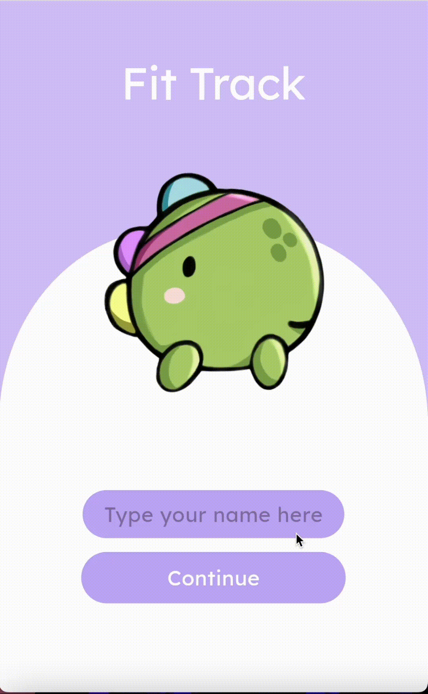

# FitTrack Workout App

FitTrack is a Flutter application designed to help users create, edit, and track their workouts. The app provides a simple and intuitive interface for managing workout routines and viewing workout history.

## Features

- **Create Workouts:** Users can create new workouts, add sections, and exercises.
- **Edit Workouts:** Users can edit existing workouts, sections, and exercises.
- **Delete Workouts:** Users can delete workouts, sections, and exercises.
- **Start Workout:** Users can start a workout and track their progress through exercises and sets.
- **Workout Timer:** Built-in timer to keep track of exercise duration and sets.
- **Save and Load Workouts:** Workouts are saved using SharedPreferences and can be loaded and edited anytime.
- **Workout History:** Users can view their workout history and access details of past workouts.
- **Theme Switching with flutter_riverpod provider:** Users can switch between light and dark themes.

## Usage

### Creating a Workout

1. On the home screen, click on the "Add Workout" button.
2. Enter the workout name and add sections by clicking on "Add Section".
3. For each section, add exercises with the "Add Exercise" button.
4. Save the workout by clicking on the "Save" button in the app bar.

### Editing a Workout

1. On the home screen, tap on the workout you want to edit.
2. Modify sections or exercises as needed.
3. Save the changes by clicking on the "Save" button in the app bar.

### Deleting a Workout

1. On the home screen, tap on the delete icon next to the workout you want to delete.
2. Confirm the deletion in the dialog that appears.

### Starting a Workout

1. On the workout detail screen, after adding exercises, click on the "Start Workout" button.
2. Follow the on-screen instructions to track your exercises, reps, and sets.
3. After each exercise, press "Start" to begin, and you can also pause the exercise.

### Switching Theme

1. On the settings screen, tap on the "Switch theme" button.

## Code Structure

- **welcome_screen.dart:** Welcome screen displayed when the app is launched.
- **start_screen.dart:** Start screen where users can start their workout sessions.
- **workout_detail_screen.dart:** Screen to view and edit workout details, sections, and exercises.
- **workout_history_screen.dart:** Screen to view workout history.
- **workout_process_screen.dart:** Screen to track and time the workout in progress.
- **timer_screen.dart:** Screen to display and manage the workout timer during exercise sessions.
- **section_detail_screen.dart:** Screen to view and edit details of workout sections.
- **appbar.dart:** Custom app bar widget.
- **final_custom_icons_icons.dart:** Custom icons used in the app.
- **settings_screen.dart:** Screen for changing app settings, including theme switching.

